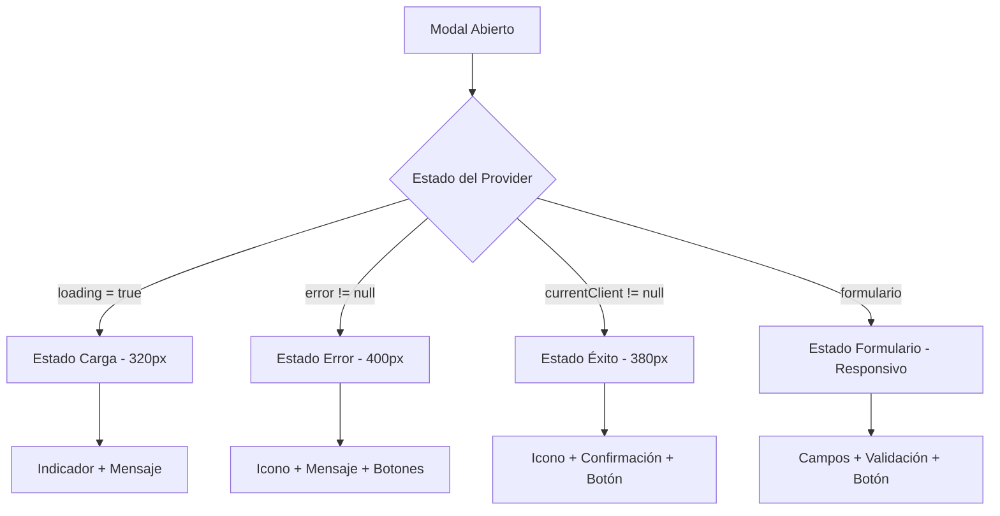

# Mejoras de Responsividad en Modal de Registro - OrdenaYa

## 🎯 **Problema Solucionado**
El modal de registro de cliente se veía muy grande en todos los estados (cargando, error, éxito), ocupando el 90% de la pantalla independientemente del contenido.

## ✅ **Mejoras Implementadas**

### 1. **Dimensiones Adaptativas por Estado**

**Antes** (tamaño fijo):
```dart
Container(
  constraints: BoxConstraints(
    maxHeight: MediaQuery.of(context).size.height * 0.9,
    maxWidth: MediaQuery.of(context).size.width * 0.9,  // ❌ Siempre 90%
  ),
  child: _buildBody(provider, context),
)
```

**Después** (tamaño adaptativo):
```dart
Container(
  constraints: BoxConstraints(
    maxHeight: screenSize.height * 0.85,
    maxWidth: _getMaxWidth(provider, screenSize),  // ✅ Dinámico
    minWidth: 300,
  ),
  child: _buildBody(provider, context),
)

double _getMaxWidth(UserProvider provider, Size screenSize) {
  if (provider.loading) return 320;           // Pequeño para loading
  else if (provider.error != null) return 400;     // Mediano para errores  
  else if (provider.currentClient != null) return 380; // Mediano para éxito
  else {
    // Formulario - responsivo
    return screenSize.width > 600 ? 500 : screenSize.width * 0.9;
  }
}
```

### 2. **Estado de Carga Mejorado**

**Antes** (solo CircularProgressIndicator):
```dart
if (provider.loading) {
  return Center(child: CircularProgressIndicator());
}
```

**Después** (estado completo y compacto):
```dart
Widget _buildLoadingState() {
  return Container(
    padding: const EdgeInsets.all(32.0),
    child: Column(
      mainAxisSize: MainAxisSize.min,  // ✅ Solo el espacio necesario
      children: [
        const CircularProgressIndicator(),
        const SizedBox(height: 16),
        const Text('Registrando cliente...'),
        const SizedBox(height: 8),
        Text('Por favor espera un momento'),
      ],
    ),
  );
}
```

### 3. **Estado de Error Rediseñado**

**Antes** (usaba StatusDisplay grande):
```dart
return StatusDisplay(
  message: extractErrorMessage(provider.error!),
  // ... muchas propiedades que hacían el modal grande
);
```

**Después** (diseño compacto y funcional):
```dart
Widget _buildErrorState(UserProvider provider, BuildContext context) {
  return Container(
    padding: const EdgeInsets.all(24.0),
    constraints: const BoxConstraints(maxWidth: 400), // ✅ Ancho limitado
    child: Column(
      mainAxisSize: MainAxisSize.min, // ✅ Solo el espacio necesario
      children: [
        // Header con botón cerrar
        Row(/* ... */),
        
        // Icono de error compacto
        Container(
          padding: const EdgeInsets.all(16),
          decoration: BoxDecoration(
            color: AppColors.redTotal.withValues(alpha: 0.1),
            shape: BoxShape.circle,
          ),
          child: HugeIcon(/* ... */),
        ),
        
        // Mensaje de error
        Text(extractErrorMessage(provider.error!)),
        
        // Botones de acción
        Row(
          children: [
            Expanded(child: OutlinedButton(/* Cancelar */)),
            Expanded(child: ElevatedButton(/* Reintentar */)),
          ],
        ),
      ],
    ),
  );
}
```

### 4. **Estado de Éxito Mejorado**

**Mejoras implementadas**:
- ✅ **Header consistente** con botón de cerrar
- ✅ **Ancho limitado** (380px máximo)
- ✅ **Icono con fondo circular** más elegante
- ✅ **Botón de ancho completo** para mejor UX

### 5. **Formulario Optimizado**

**Mejoras en el formulario**:
```dart
Widget _buildFormField({
  required String label,
  required Widget child,
  bool isLast = false,
}) {
  return Column(
    crossAxisAlignment: CrossAxisAlignment.start,
    children: [
      Text(label, style: /* estilo mejorado */),
      const SizedBox(height: 6),
      child,
      if (!isLast) const SizedBox(height: 16), // ✅ Espaciado consistente
    ],
  );
}
```

## 📱 **Dimensiones por Estado**

| Estado | Ancho | Características |
|--------|-------|----------------|
| **Loading** | 320px | Compacto, solo lo esencial |
| **Error** | 400px | Espacio para mensaje y botones |
| **Éxito** | 380px | Información de confirmación |
| **Formulario** | 500px (desktop) / 90% (móvil) | Responsivo según pantalla |

## 🎨 **Mejoras Visuales**

### **Consistencia en Headers**:
Todos los estados ahora tienen un header consistente con:
- ✅ Título descriptivo ("Error", "Éxito", "Datos del cliente")
- ✅ Botón de cerrar en la esquina superior derecha
- ✅ Espaciado uniforme

### **Iconos con Fondos Circulares**:
```dart
Container(
  padding: const EdgeInsets.all(16),
  decoration: BoxDecoration(
    color: Colors.green.withValues(alpha: 0.1), // Fondo suave
    shape: BoxShape.circle,
  ),
  child: HugeIcon(/* ... */),
)
```

### **Botones Mejorados**:
- ✅ **Loading**: Sin botones (solo indicador)
- ✅ **Error**: Dos botones (Cancelar + Reintentar)
- ✅ **Éxito**: Un botón de ancho completo
- ✅ **Formulario**: Botón principal estilizado

## 📊 **Beneficios Obtenidos**

1. **✅ Responsividad**: Se adapta al contenido y tipo de pantalla
2. **✅ UX Mejorada**: Tamaños apropiados para cada estado
3. **✅ Consistencia**: Headers y estilos uniformes
4. **✅ Eficiencia**: Usa solo el espacio necesario
5. **✅ Accesibilidad**: Botones y textos bien dimensionados

## 🔄 **Estados del Modal**



**¡El modal ahora es completamente responsivo y se adapta perfectamente a cada estado!** 📱✨